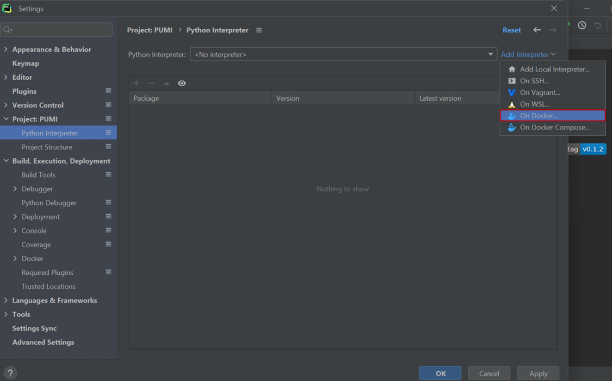

# System set up for PUMI development on Windows (via Docker)

This document contains the instructions to set up your Windows environment so that you can develop PUMI without installing all the required dependencies locally. Three elements are needed for that purpose: the PUMI source code (available on GitHub), a Python IDE (this tutorial uses Pycharm), and a Docker container that provides an isolated environment with all the necessary dependencies to run PUMI. 

To set up a Docker-based development environment on Linux: install [docker](https://docs.docker.com/desktop/install/ubuntu/) and go directly to [step 3](#step3).

***Note:** Some of the following steps might change with newer versions of WSL, Docker and PyCharm. In case of trouble, refer to the original documentations (links below).*

## 1. **Install Linux on Windows with WSL2**

*Why?* The Docker platform runs natively on Linux, so this is the first requirement to install  [Docker in Windows](https://docs.docker.com/desktop/install/windows-install/). 

###### STEPS:

- Open your Command Prompt or Windows PowerShell as administrator and type: **wsl --install**

- Restart your computer 
- Ubuntu is the installed Linux distribution by default. To see a list of Linux distributions available for download, enter: **wsl --list –online**

- Install Ubuntu 22.04 LTS, for example, using: **wsl --install -d Ubuntu-22.04** 
- Once the process of installing your Linux distribution with WSL is complete, open the distribution (Ubuntu in this case) using the Start menu. You will be asked to create a Unix Username and Password.

_Note: nothing will appear on screen when you type the password. It’s called blind typing and is completely normal :)_

- Next, download and install the [Linux kernel update package](https://wslstorestorage.blob.core.windows.net/wslblob/wsl_update_x64.msi) 
- In the PowerShell or Windows Command Prompt, type: **wsl --set-default-version 2**

*If you find any problems during the process, visit the [WSL2 installation guide](https://learn.microsoft.com/en-us/windows/wsl/install) by Microsoft for more information.*

## 2. **Install Docker Desktop on Windows and pull the PUMI container from DockerHub**

###### STEPS:

- Download [Docker Desktop for Windows](https://www.docker.com/products/docker-desktop/)
- Run the installer. It typically downloads to your Downloads folder, or you can run it from the recent downloads bar at the bottom of your web browser.
- When prompted, ensure the Use WSL 2 option on the Configuration page is selected. If your system only supports other option, you will not be able to select which backend to use.
- Follow the instructions on the installation wizard to authorize the installer and proceed with the installation. When the installation is successful, click *Close* to complete the installation process.
- Start Docker Desktop and set up your account.
- To pull and run the PUMI container, type in the command line: **docker run pnilab/pumi:latest**
You will see how the container images are downloaded:

- Once the pull is completed, you can check that the container appears in Docker Desktop:

*Note: If you do not specify a name, Docker assigns random names to the containers. To change it, type in the command line: **docker rename <old_name> <new_name>***

- Go to Settings and check the box marked with the red rectangle. This is necessary to connect the container to Pycharm.

Visit the [installation guide by Docker](https://docs.docker.com/desktop/install/windows-install/) if you encounter any problem.

## 3.	**Install Pycharm and pull the PUMI repository from GitHub**

###### STEPS:
- Install the [Professional version of Pycharm](https://www.jetbrains.com/pycharm/download/#section=windows). You can obtain the license using a student email address.

- After you install Pycharm, open it, and select *Get from VCS*:

- Paste the link of the GitHub PUMI repository and click *Clone*:

The link can be obtained from [pni-lab GitHub](https://github.com/pni-lab/PUMI):

## 4.	**Connect Pycharm and Docker**

###### STEPS:

- After you cloned the repository in Pycharm with the PUMI source code, go to _File_ &rarr; _Settings_ &rarr; _Build, Execution, Deployment_ &rarr; _Docker_. Choose the TCP socket option to connect to Docker, and type the API URL shown in Docker when performing the last step in the second section of this tutorial:

- Now, you need to specify the interpreter for your project. Go to *File* &rarr; *Settings* &rarr; *Project: PUMI* &rarr; *Python Interpreter*, and click *Add interpreter* &rarr; *Docker*:

- Choose *Image: Pull* and write **pnilab/pumi** in the image tag. Then, click *Next* twice:
 

The available interpreter will appear in the next window. Click *Create*:

You should see a similar window, with the name of the remote Docker interpreter and a list of all the packages available in it:

**Now you are ready to start developing PUMI!**

*Note: If you need to check the status of the Docker container, you can do it on the bottom part of the screen, in *Services*. If Docker is not connected, press the green arrow on the left:*

*You should be able to see the PUMI container and press start to run it:*

