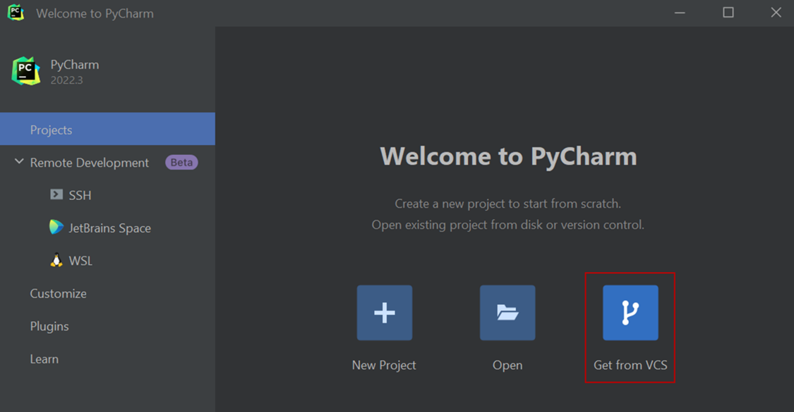

# System setup for PUMI development on Windows

If you want to run and develop PUMI in a Docker container, and your OS is Windows, you will need to follow the steps listed in this document.

## OPTION 1: Go remote with Docker

**Benefits:** No need to install locally all the dependencies to run and develop PUMI. The Docker container takes care of it.

### 1. **Install Linux on Windows with WSL**

_Why?_ This is the first requirement to install Docker in Windows: 

#### **STEPS:** 

- Open your command prompt as administrator and type: **wsl --install**

- Restart your computer 
- To see a list of available Linux distributions available for download, enter: **wsl --list –online**

- Install Ubuntu 20.04 LTS, for example, using: **wsl --install -d Ubuntu-20.04** 
- Once the process of installing your Linux distribution with WSL is complete, open the distribution (Ubuntu in this case) using the Start menu. You will be asked to create a Username and Password for your Linux distribution.

_Note: nothing will appear on screen when you type the password. It’s called blind typing and is completely normal :)_

- Download and install the Linux kernel update package 
- In the PowerShell or Windows Command Prompt, type: **wsl --set-default-version 2**

### 2. **Install Docker Desktop on Windows and pull the PUMI container from DockerHub**

#### **STEPS:**

- Download Docker Desktop for Windows
- Run the installer. It typically downloads to your Downloads folder, or you can run it from the recent downloads bar at the bottom of your web browser.
- When prompted, ensure the Use WSL 2 instead of Hyper-V option on the Configuration page is selected or not depending on your choice of backend. If your system only supports one of the two options, you will not be able to select which backend to use.
- Follow the instructions on the installation wizard to authorize the installer and proceed with the installation. When the installation is successful, click Close to complete the installation process.

_Note: if your admin account is different to your user account, you must add the user to the docker-users group. Run Computer Management as an administrator and navigate to Local Users and Groups &rarr; Groups &rarr; docker-users. Right-click to add the user to the group. Log out and log back in for the changes to take effect._

- Start Docker Desktop and set up your account.

- To pull and run the PUMI container, type in the command line: **docker run pnilab/pumi**
You will see how the images are downloaded:

- Once the pull is completed, you can check that the container appears in Docker Desktop:

- To be able to connect the container to Pycharm later, go to Settings and check the box marked with the red rectangle:

### 3.	**Install Pycharm and pull the PUMI repository from GitHub**

#### **STEPS:**
- Install the Professional version of Pycharm. You can obtain the license using a student email address.

- After you install Pycharm, open it, and select _Get from VCS_:

- Paste the link of the GitHub PUMI repository and click _Clone_:

The link can be obtained from pni-lab GitHub:

- After  you cloned the repository with the PUMI source code, go to _File_ &rarr; _Settings_ &rarr; _Build, Execution, Deployment_ &rarr; _Docker_:

- Now, go to _File_ &rarr; _Settings_ &rarr; _Project: PUMI_ &rarr; _Python Interpreter_, and click _Add interpreter_ &rarr; _Docker_:

- Choose _Image: Pull_ and write **pnilab/pumi** in the image tag. Then, click _Next_ twice:
 

The available interpreter will appear in the next window. Click _Create_:

*Now you are ready to start developing PUMI!*

